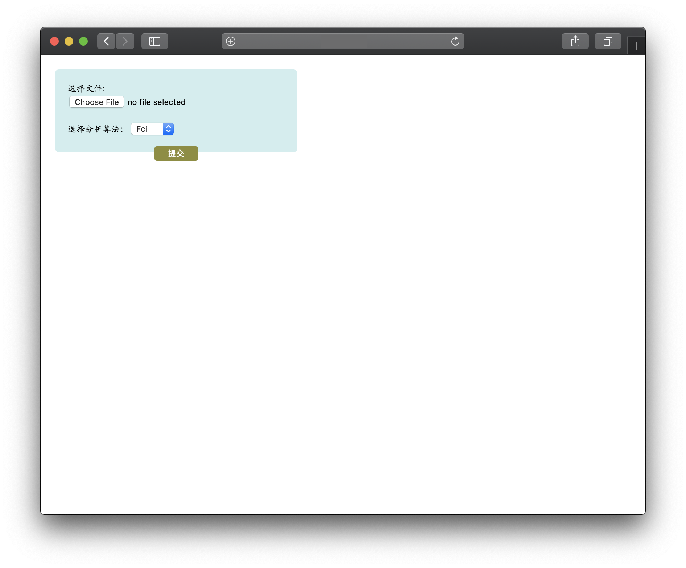
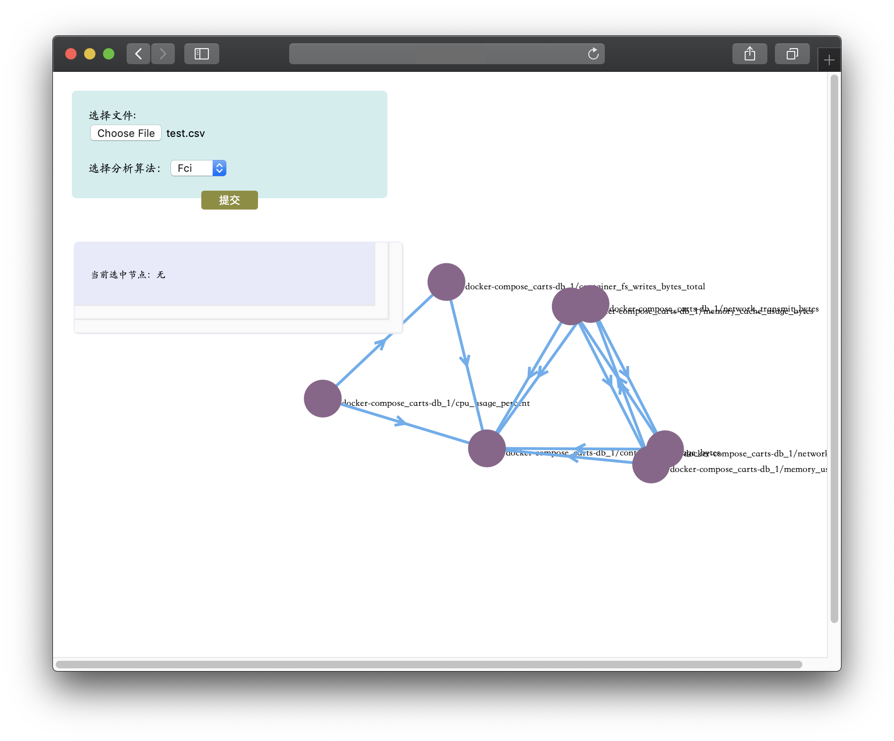

# MonitoringDataCausality

A web client to build causality graph from a monitoring dataset.

## How to Run It

Run shell script(the default port is 8080)

```shell
bash run.py -p [PORT]
```

Upload file on the page

```shell
[ip]:[PORT]
```



And you will get the causality graph of uploaded data.

## How to Build It Locally

**Environment requirements**

A java IDE, maven

**Get the project**

> git clone https://github.com/XLab-Tongji/MonitoringDataCausality.git

** Install libraries to maven**

>mvn install:install-file -Dfile=src/lib/tetrad-lib-6.7.0-SNAPSHOT.jar -DgroupId=edu.cmu -DartifactId=tetrad-lib -Dversion=6.7.0-SNAPSHOT -Dpackaging=jar -DgeneratePom=true

** Import the maven project(in CausalitySearch folder) to your IDE**